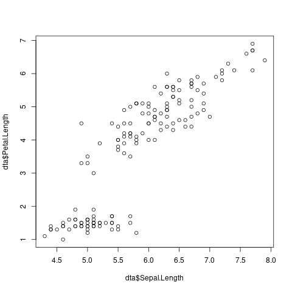

# Header

-   List item
-   Another list item

And some text with `inline code`.

``` {#codeblock1 .R additionalargument="42"}
> a <- 1+1
> b <- mean(a) + 10
> # Dit is commentaat
> c <- a+b
> c
[1] 14
> dta <- iris
```

And some text

: Sample iris

|Sepal.Length|Sepal.Width|Petal.Length|Petal.Width|Species|foo      |
|------------|-----------|------------|-----------|-------|---------|
|5.1         |3.5        |1.4         |0.2        |setosa |0.6862745|
|4.9         |3.0        |1.4         |0.2        |setosa |0.6122449|
|4.7         |3.2        |1.3         |0.2        |setosa |0.6808511|
|4.6         |3.1        |1.5         |0.2        |setosa |0.6739130|
|5.0         |3.6        |1.4         |0.2        |setosa |0.7200000|
|5.4         |3.9        |1.7         |0.4        |setosa |0.7222222|
|4.6         |3.4        |1.4         |0.3        |setosa |0.7391304|
|5.0         |3.4        |1.5         |0.2        |setosa |0.6800000|
|4.4         |2.9        |1.4         |0.2        |setosa |0.6590909|
|4.9         |3.1        |1.5         |0.1        |setosa |0.6326531|
|5.4         |3.7        |1.5         |0.2        |setosa |0.6851852|
|4.8         |3.4        |1.6         |0.2        |setosa |0.7083333|
|4.8         |3.0        |1.4         |0.1        |setosa |0.6250000|
|4.3         |3.0        |1.1         |0.1        |setosa |0.6976744|
|5.8         |4.0        |1.2         |0.2        |setosa |0.6896552|
|5.7         |4.4        |1.5         |0.4        |setosa |0.7719298|
|5.4         |3.9        |1.3         |0.4        |setosa |0.7222222|
|5.1         |3.5        |1.4         |0.3        |setosa |0.6862745|
|5.7         |3.8        |1.7         |0.3        |setosa |0.6666667|
|5.1         |3.8        |1.5         |0.3        |setosa |0.7450980|

### And some text

The mean of `Sepal.Width` is 3.06. This is larger than 2.

    Geen R-code




# Some regresion like tests

Following should result in no code block.

Following should result in an empty code block.

``` {#nooutput2 .R}
```

Following code should not be run

``` {#dontrun .R}
stop("Dit is een error")
```
