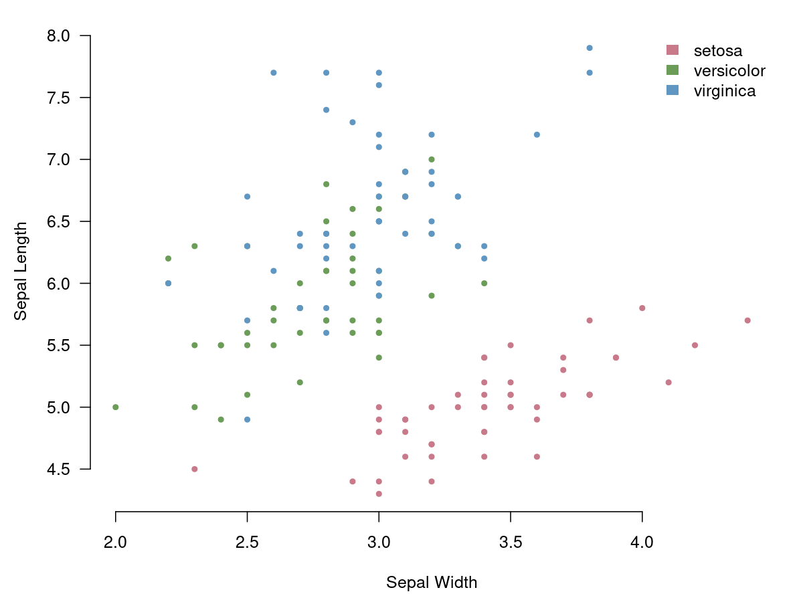

## Introduction

From the help page of the iris data set:

> This famous (Fisher's or Anderson's) iris data set gives the
> measurements in centimeters of the variables sepal length and width
> and petal length and width, respectively, for 50 flowers from each of
> 3 species of iris. The species are *Iris setosa*, *versicolor*, and
> *virginica*.

## Descriptives

The table below shows for each of the iris species the mean value of the
colums in the data set.

: Mean values for each of the properties for each of the iris species.

|Species   |Sepal.Length|Sepal.Width|Petal.Length|Petal.Width|
|----------|------------|-----------|------------|-----------|
|setosa    |5.006       |3.428      |1.462       |0.246      |
|versicolor|5.936       |2.770      |4.260       |1.326      |
|virginica |6.588       |2.974      |5.552       |2.026      |

```{.R}
pal <- hcl.colors(3, "Dark2")
plot(iris$Sepal.Width, iris$Sepal.Length, pch = 20, 
  col = pal[iris$Species], xlab = "Sepal Width", 
  ylab = "Sepal Length", bty = 'n', las = 1)
legend("topright", legend = levels(iris$Species), 
  fill = pal, bty = 'n', border = NA)
```

{#figure}

## Species prediction

``` R
library(MASS)
m <- lda(Species ~ Sepal.Width + Sepal.Length, data = iris)
p <- predict(m)
predicted_species <- p$class
table(predicted_species, iris$Species)
##                  
## predicted_species setosa versicolor virginica
##        setosa         49          0         0
##        versicolor      1         36        15
##        virginica       0         14        35
```

This model predicts in 80% of the cases the correct species. However,
this is mainly for *setosa* for the other species the model predicts the
correct species only for 71% of the records.
